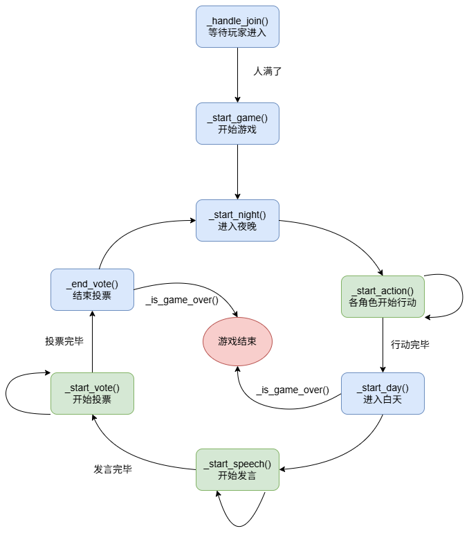
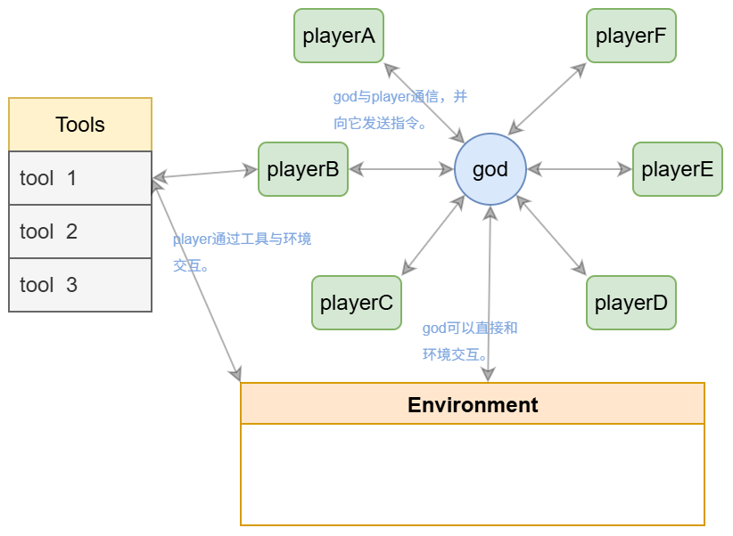

## 项目说明文档

#### 1.项目概述

##### 1.1.项目名称

基于多智能体的狼人杀。

##### 1.2.Network ID

default-network-1

##### 1.3.简介

让智能体们像人类一样玩狼人杀。

#### 2.技术架构

##### 2.1.OpenAgents版本

openagents==0.7.9

##### 2.2.Agent network设计思路

由一个中心智能体负责与其他智能体通信，并推动游戏进度。智能体之间通过环境间接交互。

##### 2.3.系统流程图

##### 2.4.架构图

#### 3.智能体设计

##### 3.1.智能体介绍

##### 3.1.1.God智能体

该系统的中心智能体，与其他Player智能体通信并推动游戏进度。

**主要功能：**

-*与Player智能体通信：*通过私聊向Player智能体发出任务。

-*推动游戏进度：*根据私聊和频道消息、存储信息判断是否推进游戏进度。比如：在玩家数量满时开始游戏；依次向各个角色发出指令，在所有玩家行动结束后结束夜晚...

-*直接与Environment交互：*God智能体可以直接与Environment交互，并修改Environment信息。

##### 3.1.2.Player智能体

作为玩家，在角色分配之后会被赋予不同的角色（狼人、村民、预言家、女巫）。LLM-based智能体，可以根据当前信息进行思考并做出行动。

**主要功能：**

-*基于自己的角色进行思考：*在God智能体发出指令之后，依据当前信息进行思考，采用ReAct模式。

-*通过工具与Environment交互：*Player智能体无法直接与Environment交互，必须通过调用工具来读取和修改特定的Environment信息。

##### 3.2.协作机制

God智能体和Player智能体之间可以直接通信，而Player与Player之间通过Environment进行间接通信。Player的行动会影响到Environment，而其他Player读取被改变的Environment实现间接交互。

#### 4.协作场景

该项目实现的是让多智能体之间进行狼人杀游戏。由God智能体推动给游戏进度，在狼人杀的规则下，其他Player智能体们依次行动、发言、投票。

#### 5.实际应用价值

实现了一套让智能体进行狼人杀的系统。目前先实现了最基础的六人局，后续可以增加更多角色。更进一步的话，可以摆脱狼人杀的框架，实现在某个剧情下各智能体的剧情演绎。也可以考虑加上人类。

#### 6.开发、发布与使用说明

详情见GitHub文档。

#### 7.团队与分工

由单人独自完成。

#### 8.遇到的挑战与解决方案

①大模型输出不符合要求：多加几层检测，对于可以直接修改的，直接修改成符合要求的格式；否则将错误信息返回给模型，让它重新生成；

②模型对于工具的使用不规范：如在白天使用夜晚才能使用的工具、多次调用相同的工具。目前是在工具层面设置判断，拒绝不符合要求的使用，如：狼人在白天使用杀人工具会被拒绝并返回拒绝信息。

③有时候模型ReAct时间过长：有时候模型会一直重复Action，而无法进入Final Answer阶段。在某些工具的返回中引导模型进入最终回复阶段。

#### 9.未来展望

希望可以实现剧本杀的形式，基于某个剧本，让智能体在有相对高的自由度下进行剧情演绎，人类也可以扮演其中的部分角色。为此，需要解决如何让智能体在长过程的记忆中仍保持设定并且不影响推理速度。同时如何用某个特定剧本推进进度也需要思考（狼人杀有一个固定的游戏流程，更容易解决）。